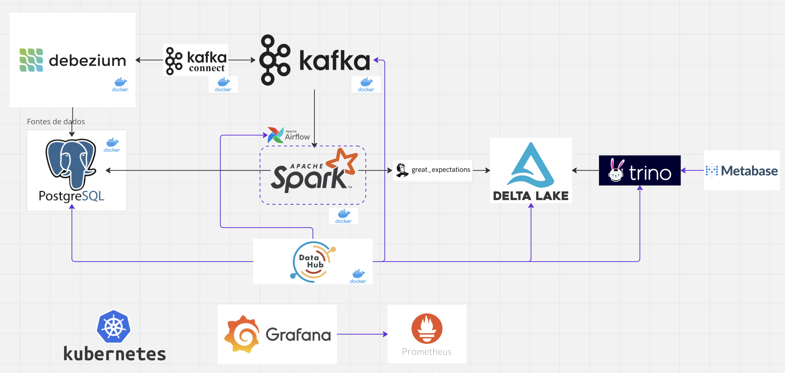

# Right lake

## O que é?
É a implementação adequada de um data lake, considerando o controle dos dados e preservando a qualidade no final do processo. Este conceito tem ganhado forca por conta do volumede dados gerado ano apos ano, entao, o datalake passa a ser um alvo muito claro para deixar de ser um lago e se tronar um pantano, onde vai ser dificil de achar dados com qualidade.

## Recursos
Vamos buscar apresentar as melhores praticas para a implementacao de um data lake, considerando principalemrnte a parte governamental e de metadados.

## Quais tecnologias vamos usar?
- Python
- Docker
- Spark
- [Airflow](https://airflow.apache.org/docs/apache-airflow/stable/howto/docker-compose/index.html)
- [PostgreSQL](https://hub.docker.com/_/postgres)
- [Kafka](https://kafka.apache.org/quickstart)
- [Trino](https://trino.io/docs/current/installation/containers.html)
- Grafana
- Prometheus
- Kubernetes
- Delta lake
- Metabase
- Great Expectations
- Kafka Connect
- Debezium

## Datasets
- [Pokemon](https://www.kaggle.com/datasets/abcsds/pokemon?resource=download)

## Algumas decisoes
- Selecionamos o docker no lugar do terraform
- Vimos que o Apache pulsar também e uma alternativa para o kafka

### Desenvolvedores
- Mateus Ferreira
- Ariel Marinho